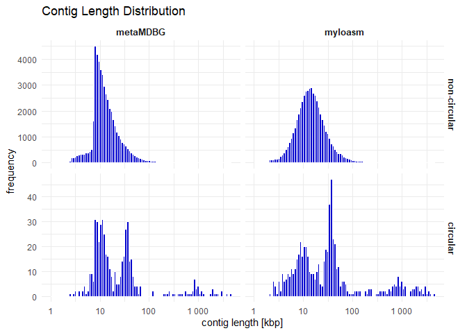
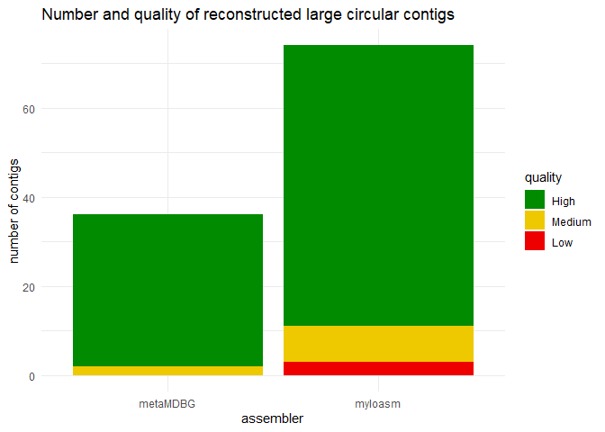

# Bioinformatics Data Processing - Final Assignment


## Project overview

The goal of this project was to evaluate and compare the performance of
the metagenomic assemblers **metaMDBG** and **myloasm**, which have been
applied to nanopore sequencing data from a hot spring micobial
community. The comparison was based on data derived from three
complementary sources:

- **contig FASTA headers**, containing information about sequence
  lengths, coverages, and other properties of the contigs,

- **Check2M**, reporting genome completeness and contamination for each
  assembler,

- and **GTDB-Tk**, providing taxonomic classification of the assembled
  genomes.

The primary objective was to assess the ability of the assemblers to
reconstruct high-quality, circular genomes.

## Data processing, analysis and visualization

### <u>Headers</u>

First, key information was extracted from the contig FASTA header files,
and separate data frames were created for each assembler. To improve
clarity, an additional column named `assembler` was added to indicate
the assembler of origin for each

Contig lengths were converted from base pairs to kilobase pairs (kbp) to
improve readability and for the purpose of subsequent analyses. The
individual tables were then combined into a single data frame containing
contig-level information from both assemblers.

Finally, suspicious or invalid observations were removed from the
dataset, such as contigs reporting a coverage value of zero.

``` r
library(tidyverse)
myloasm_headers <- read_delim(
  "myloasm_assembly_headers.txt", 
  delim = "_", 
  col_names = c("id", "len", "circ", "depth", "dup")) %>%
  mutate(
    assembler = "myloasm",
    length = as.numeric(str_remove(len, "len-")),
    length = length / 1000,
    circular = str_remove(circ, "circular-"),
    circular = if_else(circular == "no", "no", "yes"),
    coverage = as.numeric(str_extract(depth, "(?<=depth-)\\d+")),
    contig_id = str_remove(id, "^>")
  ) %>%
  select(assembler, contig_id, length, circular, coverage)

metamdbg_headers <- read_delim(
  "metamdbg_assembly_headers.txt", 
  delim = " ", 
  col_names = c("id", "len", "cov", "circ")) %>%
  mutate(
    assembler = "metaMDBG",
    length = as.numeric(str_remove(len, "length=")),
    length = length / 1000,
    coverage = as.numeric(str_remove(cov, "coverage=")),
    circular = str_remove(circ, "circular="),
    contig_id = str_remove(id, "^>")
  ) %>%
  select(assembler, contig_id, length, circular, coverage)

all_headers <- bind_rows(myloasm_headers, metamdbg_headers)
all_headers <- all_headers %>%
  filter(coverage > 0)
```

#### Plotting contig length distributions

To examine and compare the distribution of contig lengths produced by
each assembler, contig lengths were visualized using histograms. In
order to improve the clarity and interpretability of the resulting
plots, the following choices were made:

- a logarithmic scale was applied to the x-axis representing contig
  length,

- plots were stratified by assembler and contig circularity, enabling
  direct comparison between circular and non-circular contigs for each
  assembler.

``` r
library(ggplot2)
library(scales)

ggplot(all_headers, aes(x = length)) +
  geom_histogram(bins = 100, fill = "blue3", color = "white") +
  scale_x_log10(labels = label_number()) +
  facet_grid(circular ~ assembler,
             scales = "free_y",
             labeller = labeller(circular = c("no" = "non-circular", "yes" = "circular"))) +
  labs(
    title = "Contig Length Distribution",
    x = "contig length [kbp]",
    y = "frequency"
  ) +
  theme_minimal() +
  theme(
    strip.text = element_text(face = "bold", size = 10)
  )
```



The contig length distributions indicate clear differences between the
two assemblers. While both metaMDBG and myloasm produce a large number
of short contigs, myloasm shows a broader distribution of contig lengths
and appears more effective at reconstructing long, potentially complete
genomes.

#### Relationship between contig length and sequencing coverage

To evaluate the relationship between contig length and sequencing
coverage, the data were visualized using scatter plots. Both axes were
displayed on a logarithmic scale due to the wide range of values.

An ordinary least squares linear regression was overlaid using
`geom_smooth()` in order to highlight overall trends in the data.
Initially, both assemblers were displayed side by side using faceting to
allow for direct visual comparison between assemblers, but due to the
large number of contigs, the points on the faceted plots appeared too
crowded. Therefore, separate plots were additionally generated for each
assembler, enabling clearer inspection.

Both visualization approaches were retained, as the faceted plot
supports immediate comparison between assemblers, while the individual
plots improve readability and interpretation, even if just slightly.

``` r
ggplot(all_headers, aes(x = coverage, y = length)) +
  geom_point(alpha = 0.8, mapping = aes(shape = circular, colour = circular)) +
  scale_x_log10(labels = label_number()) + 
  scale_y_log10(labels = label_number()) +
  facet_wrap(~assembler) +
  # Adding a linear regression line to see the correlation trend
  geom_smooth(method = "lm", color = "black", se = FALSE, linewidth = 0.5, linetype = "dashed") +
  labs(
    title = "Correlation: Contig Length vs. Coverage",
    x = "coverage",
    y = "contig length [kbp]",
    color = "circular"
  ) +
  theme_minimal() +
  theme(
    strip.text = element_text(face = "bold", size = 10),
    strip.background = element_blank(),
    legend.position = "bottom"
    )
```


``` r
ggplot(metamdbg_headers, aes(x = coverage, y = length)) +
  geom_point(alpha = 0.8, mapping = aes(colour = circular, shape = circular)) +
  scale_x_log10() + 
  scale_y_log10() +
  geom_smooth(method = "lm", color = "black", linetype = "dashed", se = FALSE) +
  labs(
    title = "Correlation: Contig Length vs. Coverage",
    subtitle = "metaMDBG",
    x = "coverage",
    y = "contig length [kbp]"
  ) +
  theme_minimal()
```


``` r
myloasm_headers <- myloasm_headers %>%
  filter(coverage > 0)

ggplot(myloasm_headers, aes(x = coverage, y = length, color = circular)) +
  geom_point(alpha = 0.8, mapping = aes(colour = circular, shape = circular)) +
  scale_x_log10() + 
  scale_y_log10() +
  geom_smooth(method = "lm", color = "black", linetype = "dashed", se = FALSE) +
  labs(
    title = "Correlation: Contig Length vs. Coverage",
    subtitle = "myloasm",
    x = "coverage",
    y = "contig length [kbp]"
  ) +
  theme_minimal()
```


Analysis of the relationship between contig length and sequencing
coverage revealed that myloasm produces large circular contigs already
at low coverage. This can be both positive and negative - it may indicate
a higher ability to assemble long contigs from limited sequencing depth;
however, assemblies generated at lower coverage may also be associated
with increased uncertainty.

In contrast, metaMDBG reconstructed fewer circular contigs overall and
tended to do so predominantly at higher coveragee.

### <u>CheckM2 and GTDB-Tk</u>

The next step focused on integrating and processing the data reported by
CheckM2 and GTDB-Tk, which provide information on genome quality and
taxonomic classification, respectively.

For the CheckM2 output, the relevant columns were extracted, namely the
genome identifier (`Name`, renamed to `contig_id`), completeness, and
contamination. As in previous steps, an additional `assembler` column
was added.

For the GTDB-Tk taxonomy results, the columns `user_genome` (renamed to
`contig_id`) and `classification` were kept. From the classification
string, the phylum-level taxonomy was extracted into a separate column.
Finally, the archaeal and bacterial taxonomy datasets were combined for
each assembler into a single data frame.

``` r
myloasm_CheckM2_raw <- read_tsv("CheckM2/myloasm/quality_report.tsv")
metamdbg_CheckM2_raw <- read_tsv("CheckM2/metamdbg/quality_report.tsv")
  
myloasm_CheckM2 <- myloasm_CheckM2_raw %>%
  mutate(assembler = "myloasm") %>%
  select(contig_id = Name, completeness = Completeness, contamination = Contamination)
  
metamdbg_CheckM2 <- metamdbg_CheckM2_raw %>%
  mutate(assembler = "metaMDBG") %>%
  select(contig_id = Name, completeness = Completeness, contamination = Contamination)
```

``` r
# MYLOASM GTDB-Tk
## bac
myloasm_bac120_raw <- read_tsv("GTDB-Tk/myloasm/classify/gtdbtk.bac120.summary.tsv")

myloasm_bac120 <- myloasm_bac120_raw %>%
  select(contig_id = user_genome, classification) %>%
  mutate(
    # Extract text after 'p__' but before the next ';'
    phylum = str_extract(classification, "(?<=p__)[^;]+")
  )

## ar
myloasm_ar53_raw <- read_tsv("GTDB-Tk/myloasm/classify/gtdbtk.ar53.summary.tsv")

myloasm_ar53 <- myloasm_ar53_raw %>%
  select(contig_id = user_genome, classification) %>%
  mutate(
    # Extract text after 'p__' but before the next ';'
    phylum = str_extract(classification, "(?<=p__)[^;]+")
  )

myloasm_taxonomy <- bind_rows(myloasm_ar53, myloasm_bac120)

# METAMDBG GTDB-Tk
## bac
metamdbg_bac120_raw <- read_tsv("GTDB-Tk/metamdbg/classify/gtdbtk.bac120.summary.tsv")

metamdbg_bac120 <- metamdbg_bac120_raw %>%
  select(contig_id = user_genome, classification) %>%
  mutate(
    phylum = str_extract(classification, "(?<=p__)[^;]+")
  )

## ar
metamdbg_ar53_raw <- read_tsv("GTDB-Tk/metamdbg/classify/gtdbtk.ar53.summary.tsv")

metamdbg_ar53 <- metamdbg_ar53_raw %>%
  select(contig_id = user_genome, classification) %>%
  mutate(
    phylum = str_extract(classification, "(?<=p__)[^;]+")
  )

metamdbg_taxonomy <- bind_rows(metamdbg_ar53, metamdbg_bac120)
```

Finally, the quality reports were joined with the taxonomy reports and
the rows reporting “Unclassified” in the classification column were
removed. The resulting datasets were then merged with the contig-level
information extracted from the headers for each assembler, producing the
data frames `myloasm_complete` and `metaMDBG_complete`.

For further analyses, a combined data frame (`master_data`) was created
by binding the two complete datasets together and keeping only circular
contigs larger than 500 kbp.

``` r
myloasm_tax_CheckM2 <- myloasm_CheckM2 %>%
  left_join(myloasm_taxonomy, by = "contig_id") %>%
  filter(!str_detect(classification, "Unclassified"))

metamdbg_tax_CheckM2 <- metamdbg_CheckM2 %>%
  left_join(metamdbg_taxonomy, by = "contig_id") %>%
  filter(!str_detect(classification, "Unclassified"))
```

``` r
myloasm_complete <- myloasm_headers %>%
  left_join(myloasm_tax_CheckM2, by = "contig_id")

metamdbg_complete <- metamdbg_headers %>%
  left_join(metamdbg_tax_CheckM2, by = "contig_id")

master_data <- bind_rows(myloasm_complete, metamdbg_complete) %>%
  filter(circular == "yes") %>%
  filter(length > 500)
```

#### Quality criteria, visualization of tresholds

Genome quality for large circular contigs (\>500 kbp) was evaluated
using CheckM2 completeness and contamination estimates, following the
thresholds provided in the assignment.

Each metagenome-assembled genome (MAG) was assigned to one of three
quality categories:

- **High quality**: completeness \> 90% and contamination \< 5%

- **Medium quality**: completeness \> 50% and contamination \< 10%

- **Low quality**: MAGs not meeting the criteria above

Quality categories were stored as an ordered factor to ensure consistent
ordering in visualizations. The distribution of quality classes was then
visualized using a stacked bar chart, allowing direct comparison of both
the number and quality of large circular contigs reconstructed by each
assembler.

``` r
# Categorize MAGs based on thresholds in the assignment
tresholds <- master_data %>%
  mutate(quality = case_when(
    completeness > 90 & contamination < 5  ~ "High",
    completeness > 50 & contamination < 10 ~ "Medium",
    TRUE                                   ~ "Low"
  )) %>%
  # Convert to factor to ensure they appear in the correct order in legends/plots
  mutate(quality = factor(quality, levels = c("High", "Medium", "Low")))
```

``` r
ggplot(tresholds, aes(x = assembler, fill = quality)) +
  geom_bar() +
  scale_fill_manual(values = c("High" = "green4",
                               "Medium" = "gold2",
                               "Low" = "red2")) +
  labs(
    title = "Number and quality of reconstructed large circular contigs",
    x = "assembler",
    y = "number of contigs",
    fill = "quality"
  ) +
  theme_minimal() +
  theme(strip.text = element_text(face = "bold"))
```



Both assemblers reconstructed high-quality large circular contigs.
Although myloasm also generated a small number of low-quality contigs,
the overall yield of large circular contigs was much higher for myloasm
and it produced a substantially higher number of high-quality contigs
compared to metaMDBG.

#### Phylum distribution per assembler

The number of large circular contigs assigned to each phylum was
visualized using bar plots, stratified by assembler via faceting.

``` r
# Phylum distribution per assembler
ggplot(master_data, aes(y = phylum, fill = phylum)) +
  geom_bar() +
  facet_wrap(~assembler) +
  labs(
    title = "Number of large circular contigs per phylum",
    x = "count",
    y = "phylum"
  ) +
  theme_minimal() +
  theme(legend.position = "none",
        axis.text.y = element_text(size = 8),
        strip.text = element_text(face = "bold", size = 10),
        strip.background = element_blank())
```


Both assemblers recovered genomes from similar major microbial phyla.
Nevertheless, myloasm reconstructed a higher number of large circular
contigs across most phyla and it also covered broader taxonomic range.

## Summary

Based on contig length distributions, coverage–length relationships, and
the quality and taxonomic reports, **myloasm appears to outperform
metaMDBG** in reconstructing large (\>500 kbp), circular, high-quality
contigs from the analyzed dataset. While both assemblers are capable of
producing high-quality assemblies, myloasm consistently reconstructs a
higher number of long circular contigs across multiple phyla, suggesting
better performance in this context.


